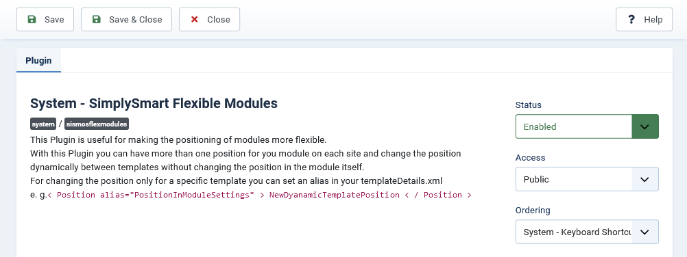
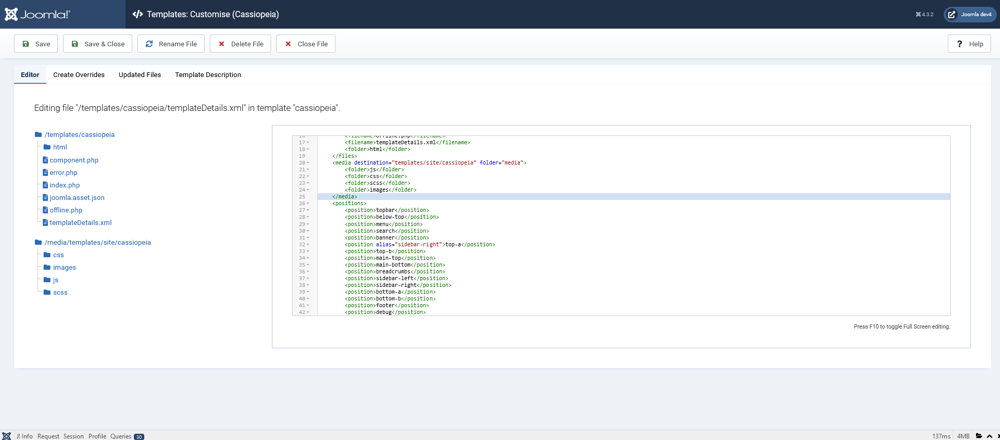
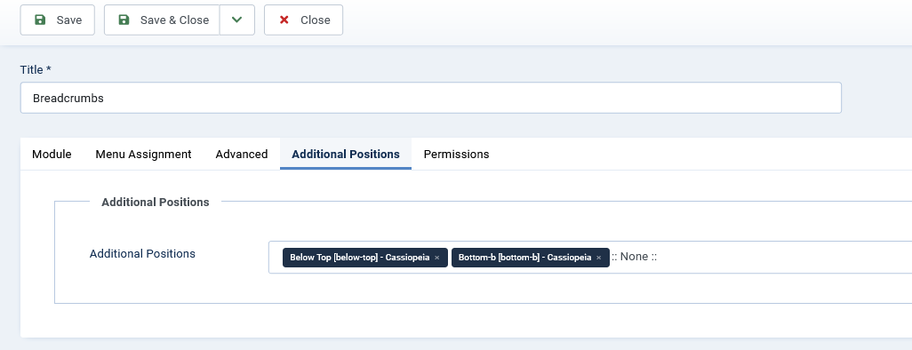

<h1 align="center">SimplySmart FlexModule Plugin für Joomla</h1><h2 align="center">Martina Scholz - SimplySmart Open Source</h2>

  

  

  

  

<!-- Status -->

<h4 align="center"> 
	  SimplySmart FlexModule Plugin für Joomla
</h4> 

  <a href="#sparkles-about">About</a> &#xa0; | &#xa0;
  <a href="#mag_right-technologies">Technologies</a> &#xa0; | &#xa0;
  <a href="#white_check_mark-requirements">Requirements</a> &#xa0; | &#xa0;
  <a href="#checkered_flag-starting">Let's start</a> &#xa0; | &#xa0;
  <a href="#memo-license">License</a> &#xa0; | &#xa0;
  <a href="https://github.com/SimplySmart-IT" target="_blank">Author</a>

 

## :sparkles: About ##

**This Plugin is useful to make the positioning for your modules more flexible in your Joomlab4 CMS.**

:heavy_check_mark: Clone module in different additional positions on the same site\
:heavy_check_mark: Switch position dynamically only for a special template with an alias in your templateDetails.xml\

&#xa0;

## :white_check_mark: Requirements ##

In order to be able to use this plugin, you need a Joomla installation in version 4 or higher ([Joomla](https://www.joomla.org/)[^1] - [Joomla auf Deutsch](https://www.joomla.de/))[^1].

&#xa0;

## :checkered_flag: Let's start ##

The plugin is available for download as stable version 1.0.0.

### Step 1 - Install and activate the plugin

Installation of the plugin as usual in the installation manager of Joomla.
Look for the plugin in the plugin list and activate it if necessary.

### Step 2 - Change module position dynamically in your template

Open the templateDetails.xml in your Joomla instance under System -> Site Template.

Add an alias into your position.

In this example all modules that have set the setting position: "sidebar

### Step 3 - Show a module on multiple positions on the same site without copying the module

Open the module you want to show on multiple positions and choose the new tab "Additional Positions".

Select one or more additional positions from the list.

Selecting additional positions clones and renders the module in the selected positions. The dynamically cloned modules get their own derived ID. Please only use this option if the content of the module does not work with static IDs, otherwise you may experience unwanted behavior on your site.

&#xa0;

## Your support
Would you like to support me and my future developments?!? :tada::rocket: Thank you very much !!! :heart:

&#xa0;

## :mag_right: Technologies ##

The following tools were used to create this this project:

- [Joomla](https://www.joomla.org/)[^1]
- [Digital-Peak/DPDocker](https://github.com/Digital-Peak/DPDocker)

## :memo: License ##

This project is under GNU General Public License version 2 or later;. For more details, see the [LICENSE](LICENSE.md) file.

Made with :heart: by <a href="https://github.com/SimplySmart-IT" target="_blank">Martina Scholz</a>

&#xa0;

[^1]: This plugin - SimplySmart FlexModule for Joomla - is not affiliated with or endorsed by The Joomla! Project™. Any products and services provided through this site are not supported or warrantied by The Joomla! Project or Open Source Matters, Inc. Use of the Joomla!® name, symbol, logo and related trademarks is permitted under a limited license granted by Open Source Matters, Inc.

<a href="#top">Back to top</a>
